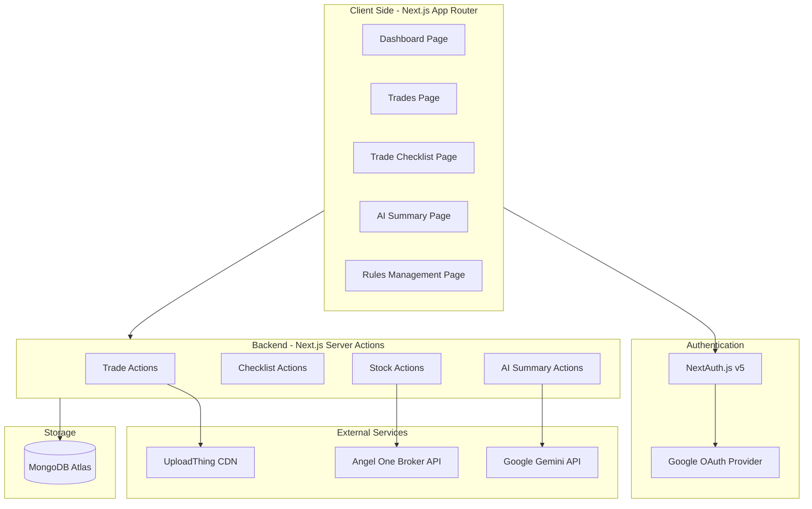

# 📈 Trade Logger

A modern, full-stack, and secure trading journal and daily checklist application built to help traders track their performance, log trades, manage rules, and generate AI-powered performance summaries. The application integrates seamlessly with the **Angel One SmartAPI** for real-time stock searches and is backed by **Google Gemini API** for advanced performance diagnostics.

---

## 🏗️ Architecture Overview

The project is built on **Next.js (App Router)** utilizing **Server Actions** for secure backend execution and data fetching. 



---

## ✨ Key Features

1. **Dashboard & Analytics**: Monitor critical performance metrics such as Win Rate, Profit Factor, Net PnL, trade distribution, and correlation charts between Entry Confidence/Satisfaction ratings and trade outcomes.
2. **Interactive Trading Journal**: Log and manage trades with comprehensive data: entry/exit prices, volume, strategies, entry confidence, satisfaction ratings, qualitative mistakes, lessons learned, and screenshot attachments.
3. **Daily Trade Checklist**: A session checklist grouped by market phases (*Pre-Market*, *Entry*, *Risk Management*, *Exit*, *Post-Trade*). Includes a background timer to sync and reset daily sessions, and manual session archiving.
4. **Rules & Strategy Configurator**: CRUD interface to customize checklist rules, assign priorities (*Low*, *Medium*, *High*, *Critical*), order checks, and define personalized trading strategies.
5. **AI Performance Summary**: Connects to the **Google Gemini API** (`gemini-2.5-flash`) to analyze a selected date range's trading log, generating an executive review of strengths, weaknesses, behavior analysis, and actionable coaching feedback.
6. **Real-time Stock Search**: Search and retrieve live scrips/symbols across Indian markets (NSE, BSE, NFO, MCX) and fetch real-time market data (Nifty Top 10) through integration with **Angel One's SmartAPI**.
7. **Secure Storage & Auth**: Log in securely via Google OAuth. Trade attachments are uploaded to **UploadThing**'s high-speed CDN.

---

## 🛠️ Technology Stack

- **Framework**: [Next.js 16.2.4](https://nextjs.org/) (App Router, Server Actions)
- **Runtime Environment**: Node.js & Edge Runtime (Middleware)
- **Database**: [MongoDB](https://www.mongodb.com/) via [Mongoose](https://mongoosejs.com/)
- **Authentication**: [NextAuth.js v5 (Beta)](https://authjs.dev/) with Google Provider
- **AI Integrations**: [Google Gemini API](https://ai.google.dev/) (`gemini-2.5-flash`)
- **Third-Party Broker API**: [Angel One SmartAPI](https://smartapi.angelone.in/) (`smartapi-javascript`) with TOTP MFA support
- **Media Upload**: [UploadThing](https://uploadthing.com/)
- **Styling**: Tailwind CSS v4, Radix UI Primitives, Lucide React, React Icons
- **Data Visualization**: Recharts

---

## 📂 Project Structure

```text
trade-logger/
├── public/                 # Static assets (logo icons, etc.)
├── src/
│   ├── actions/            # Next.js Server Actions (grouped by domain)
│   │   ├── aiSummary/      # Gemini API integrations and prompts
│   │   ├── checklist/      # Checklist sessions and archive logging
│   │   ├── stocks/         # Angel One SmartAPI queries & market data
│   │   ├── strategies/     # Strategy CRUD actions
│   │   ├── trades/         # Trade logging and matching logic
│   │   └── users/          # User sign-out and session handling
│   ├── app/                # Next.js Router
│   │   ├── (auth)/         # Public auth routes (Login)
│   │   ├── (private)/      # Protected routes (Dashboard, Trades, Rules, AI, Checklist)
│   │   ├── api/            # API Route Handlers (Auth, UploadThing endpoints)
│   │   ├── globals.css     # Global stylesheets and Tailwind configuration
│   │   └── layout.tsx      # Main HTML envelope
│   ├── components/         # Reusable UI Components
│   │   ├── common/         # SideBar, Header, Tooltip, Providers
│   │   └── pages/          # Views & Sub-components (Dashboard, Trade, Rules, Checklist, AI)
│   ├── lib/                # Shared libraries (MongoDB connection, Tailwind utilities)
│   ├── models/             # Mongoose schemas (User, Trade, Strategies, TradeChecklist, etc.)
│   ├── types/              # TypeScript declarations and navigation schema
│   ├── utils/              # Auth configurations and UploadThing helpers
│   └── middleware.ts       # Edge route protection & redirect controller
├── package.json            # Scripts & project dependencies
├── tsconfig.json           # TypeScript configuration
└── components.json         # Shadcn config file
```

---

## 🔑 Environment Variables Configuration

Create a `.env` file in the root directory of your project and populate it with the following configuration keys:

```ini
# Database Connection
MONGODB_URI=mongodb+srv://<username>:<password>@<cluster-url>/trade_logger?retryWrites=true&w=majority

# App Encryption & Keys
SECRET_KEY=your_app_encryption_secret_key

# Google OAuth Setup (NextAuth.js v5)
GOOGLE_CLIENT_ID=your_google_oauth_client_id.apps.googleusercontent.com
GOOGLE_CLIENT_SECRET=your_google_oauth_client_secret
AUTH_SECRET=your_nextauth_auth_secret_key

# Angel One SmartAPI Integration
ANGEL_API_KEY=your_angel_one_api_key
ANGEL_PIN=your_angel_one_4_digit_pin
ANGEL_CLIENT_ID=your_angel_one_client_id
ANGEL_TOTP_SECRET=your_angel_one_totp_seed_secret

# UploadThing configuration
UPLOADTHING_SECRET=sk_live_your_uploadthing_secret_key
UPLOADTHING_TOKEN=your_uploadthing_token

# Google Gemini API key
GEMINI_API_KEY=your_gemini_api_key
```

---

## ⚡ Getting Started

### 1. Prerequisites
Ensure you have **Node.js** (v18.x or later) and **npm** installed.

### 2. Install Dependencies
Clone the repository and run:
```bash
npm install
```

### 3. Run Development Server
Start the Next.js development server:
```bash
npm run dev
```
Open [http://localhost:3000](http://localhost:3000) in your browser to view the application.

### 4. Build for Production
To build the application for production:
```bash
npm run build
npm run start
```

---

## 🗄️ Database Schemas

The application defines six Mongoose models inside the `src/models/` folder:

### 1. `User`
Tracks authenticated Google accounts.
- `google_id` (String, unique): Primary key linking to Google profile identifiers.
- `first_name`, `last_name`, `email` (String).
- `image` (String): Google profile picture URL.

### 2. `Trade`
Core record containing trade characteristics and notes.
- `user_id` (Ref to `User`).
- `symbol` (String).
- `entry_price`, `exit_price`, `quantity`, `pnl_nominal` (Decimal128).
- `pnl_percentage` (Number).
- `entry_time`, `exit_time` (Date).
- `strategy_id` (Ref to `Strategies`).
- `side` (Enum: `'Long'`, `'Short'`).
- `asset_class` (Enum: `'Equity'`, `'Crypto'`, `'Forex'`, `'Options'`).
- `entry_confidence` & `satisfaction_rating` (Number, 1 to 10 scale).
- `mistakes_made` & `lessons_learned` (Array of Strings).
- `trade_doc_url` (Array of Strings): Uploaded screenshots.

### 3. `TradeChecklist`
Custom trading rules defined by the trader.
- `user_id` (Ref to `User`).
- `title` (String), `description` (String).
- `category` (Enum: `'Pre-Market'`, `'Entry'`, `'Risk Management'`, `'Exit'`, `'Post-Trade'`).
- `priority` (Enum: `'Low'`, `'Medium'`, `'High'`, `'Critical'`).
- `order` (Number): Manual ordering index.
- `is_active` (Boolean).

### 4. `ChecklistSession`
Tracks daily checklist verification state.
- `user_id` (Ref to `User`).
- `date_string` (String): Normalized date identifier (`toDateString()`).
- `completed_ids` (Array of Strings): References to completed `TradeChecklist` rule IDs.

### 5. `ChecklistHistory`
Aggregates historical daily checklists.
- `user_id` (Ref to `User`).
- `date` (Date).
- `total` & `completed` (Number).
- `percentage` (Number).
- `items` (Array of Strings): List of titles of completed rules.

### 6. `Strategies`
Definitions of different trading strategies.
- `user_id` (Ref to `User`).
- `title` (String), `description` (String).

---

## 🔒 Security & Route Protection

All private routes (e.g., `/dashboard`, `/trades`, `/rules`, `/ai-summary`, `/trades-checklist`) are protected using an edge-compatible **NextAuth Middleware** callback located in [utils/auth.config.ts](file:///e:/trade-logger/src/utils/auth.config.ts). Non-authenticated traffic is automatically redirected back to the `/login` portal.
